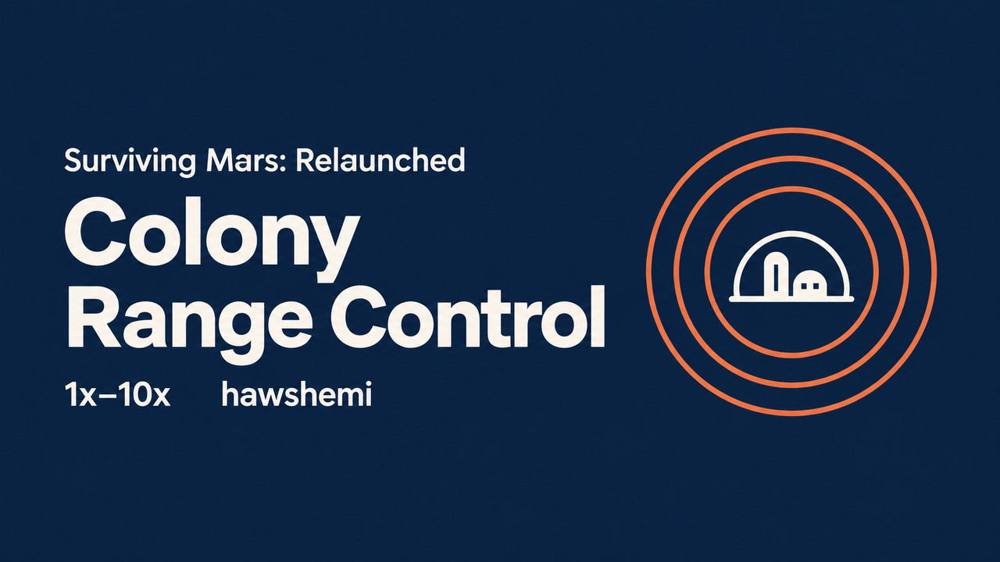
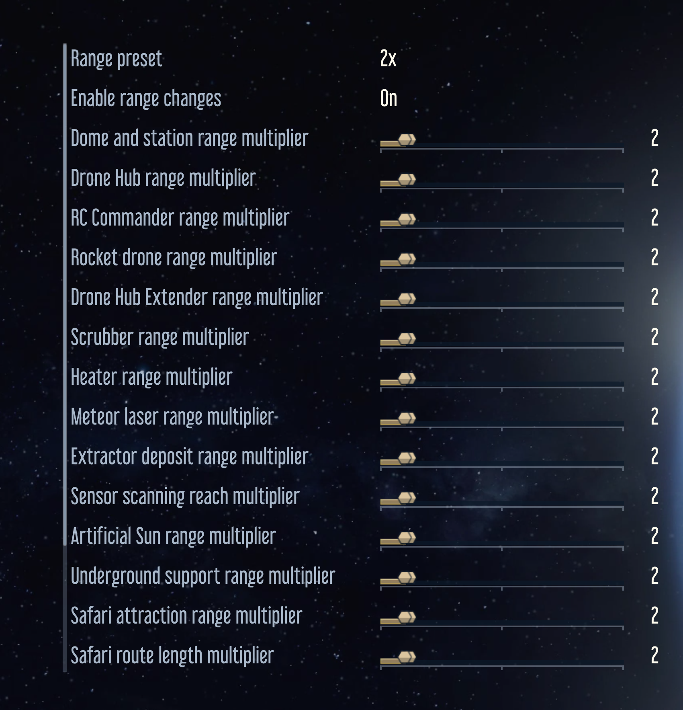

# Colony Range Control

Adjust 17 colony ranges from 1x to 10x in **Surviving Mars: Relaunched**. By hawshemi.

## Install

Get it on [Paradox Mods](https://mods.paradoxplaza.com/mods/160315/Any), enable it, and restart the game. Disable other mods that change the same ranges.

For manual installation, copy the contents of [mod](mod) into your local mod folder.

## Options

Choose **2x** (default), **5x**, **10x**, or **Custom** in Mod Options. Custom lets you adjust each range from 1x to 10x. Apply to update your colony and view the range report.

Larger heater and scrubber ranges still use more power. The mod warns about possible conflicts with other range mods.

## Remove

In a loaded colony, turn off **Enable range changes** and apply. Save, disable the mod, and restart. Existing safari routes remain unchanged.

For game version 1.1.0.403908. [MIT license](LICENSE).
